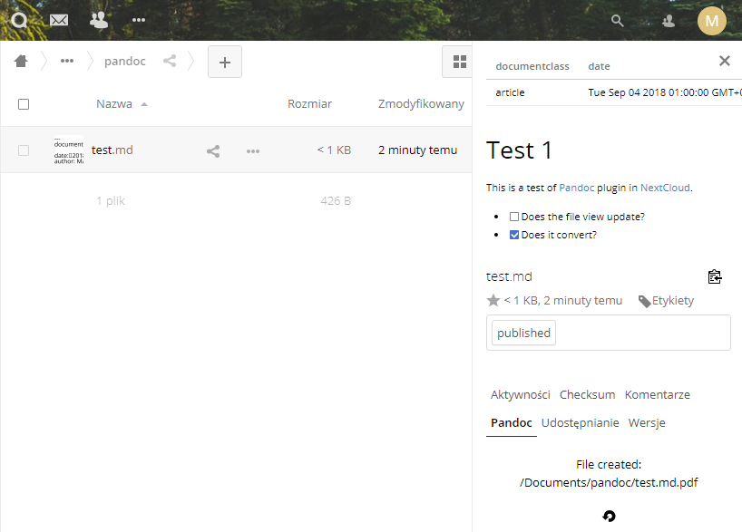

Nextcloud Pandoc plugin
=======================

**Plugin for [Nextcloud](https://nextcloud.com) to convert between text/office formats using [Pandoc](http://pandoc.org).**
It is a fork of [Checksum plugin for owncloud](https://github.com/westberliner/owncloud-checksum).

Installation
------------

Download the repository files and copy into `nextcloud/apps/pandoc` directory.
Pandoc must be installed on the Nextcloud server.
To convert documents to PDF, LaTeX is required as well. 
After copying, enable this app in the admin interface.

Usage
-----

Just open the details view of the supported file (Sidebar). There should be a new tab called "Pandoc". Select the output format and it will try to use Pandoc on the source file to convert it to the output format.
If converting LaTeX documents to PDF, Pandoc is not used.
Once created, currently (!) the files are not visible in files view until you refresh the page.
If you want an other output format, just click on the reload button.

For supported input and output formats, read Pandoc documentation.

Security
--------

Consider this plugin as **insecure**.
Use it only in safe environment: available in internal networks and for trusted people only.

Compatibility
-------------

Tested on Nextcloud 13 only with pandoc 1.17.2.
